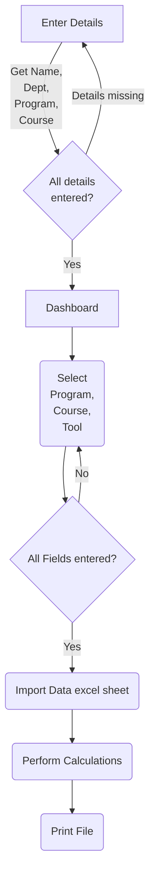

```mermaid
flowchart TD
    A[Enter Details] -->|Get Name,\n Dept,\n Program,\n Course | B{All details \nentered?}
    B -->|Details missing| A
    B -->|Yes|C[Dashboard]
    C-->D(Select\n Program,\n Course,\nTool)
    D-->E{All Fields entered?}
    E-->|No|D
    E-->|Yes|F(Import Data excel sheet)
    F-->G(Perform Calculations)
    G-->H(Print File)
``` 
